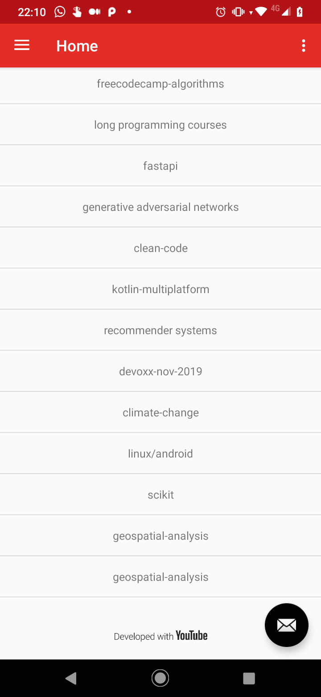

# Tuyo - Playlist Manager for Youtube [Archived]

Login View                 |   Sign In View                |             User Playlists         |    Playlist Items             |
:-------------------------:|:-----------------------------:|:----------------------------------:|:-----------------------------:|
 |   |  |  |

### Notes on Archivation

I decided to archive this project when I found out about the quota limitation on the YouTube Data API, which are too limiting for what 
I intended to do (batch update of playlists). The API gives a quota of 10000 points on a per-app basis (not per user) and since each
update requests requires 50 points, it would only be possible to do 200 playlists changes before hitting the API limit for all users.
I believe a web based application might be more well-suited for this idea.

